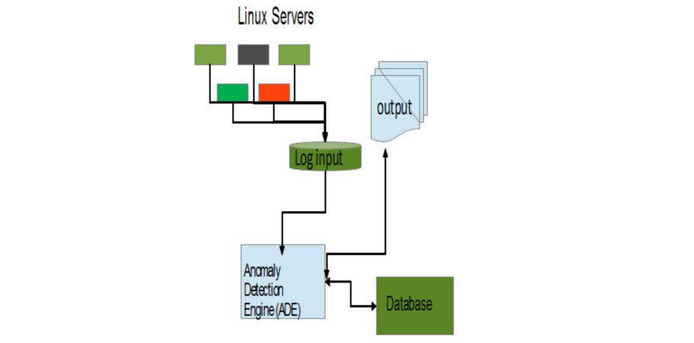
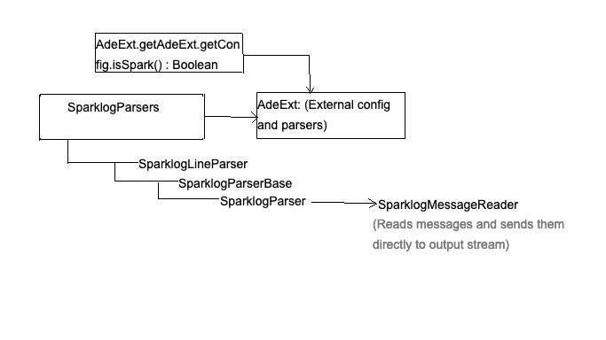

## Where does ADE come in?



(Image taken from Jim Caffrey's presentation slides @EEC 2016)

## Components:

1. External parameter to invoke these parameters:
    - Adding `useSpark=true` in setup.props sets the isSpark attribute in AdeExt to true. (False by default).

    ``` java
    AdeExt.getAdeExt().getConfigProperties().isSpark()
    ```

2. Parsers



The result then passes through pre-processing steps (i.e AdeMaskLog.java)

3. Scripts for invoking these parsers

## Components of a single Spark message

A simple Spark log message: `17/03/29 19:55:54 INFO broadcast.TorrentBroadcast[123]: Started reading broadcast variable 4`

Here,

- Time stamp: `17/03/29 19:55:54`
- Source: `INFO`
- Component: `broadcast.TorrentBroadcast`
- Process ID: `123`
- Message text: `Started reading broadcast variable 4`

A log file typically consists of thousands of such messages.


(This page might be updated in the future)