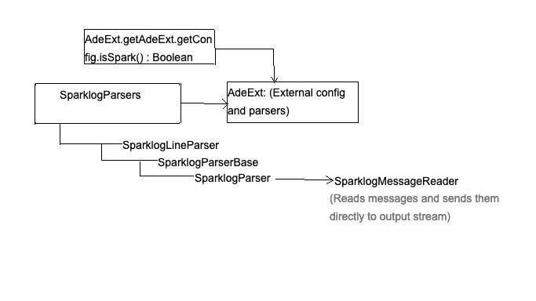

## Project Description

This project aims at upgrading and enhancing OpenMainframeProject/ade, by implementing parsers for Spark logs. The ADE project was started in early 2016, with the purpose of making prevalent Linux systems more stable by implementing a framework to help in quick traceablility of the source of an unusual occurrence by predicting anomalous logs from Linux Syslogs. Analysis of the anomalous logs can be a good indication of the root of the problem, thus helping in eradicating such issues. This is specially important when working in an environment where every second is important, and fatal system crashes can mean the loss of tens of thousands of dollars. Such systems, for example stock markets, can be hugely benefited by a system that identifies the origin of the anomaly, which can be the cause of a fatal crash.
However, ADE supports only Linux Syslogs at the moment. With this project, I aim to enhance ADE by expanding it to support middleware areas, such as nginx/spark logs. I hope this project is a solid move towards more robust anomaly detection. It should also help in showcasing the ability of ADE to deliver results in the case of comparatively more complicated logs.

## Steps involved:

1. Adding a new parameter in setup file to indicate if the logs are spark or not. Parsing this parameter to invoke spark specific
functions whenever necessary.

2. Adding parsers for Spark logs.

3. Adding tests for the parsers to ensure the regex matches the format of groups to be extracted.

4. Adding conditions for invoking spark parsers and functions in other files (AdeMaskLog.java for example).

5. Using the parsers to push data into the new spark database.

6. Adding specific analyze scripts for spark.

7. Training and verifying the results.

8. Adding end-to-end scripts to create, push, query database and train the model. (similar to analysis_comp_test.sh , but for
Spark logs.)

## AdeExt : Parsers

